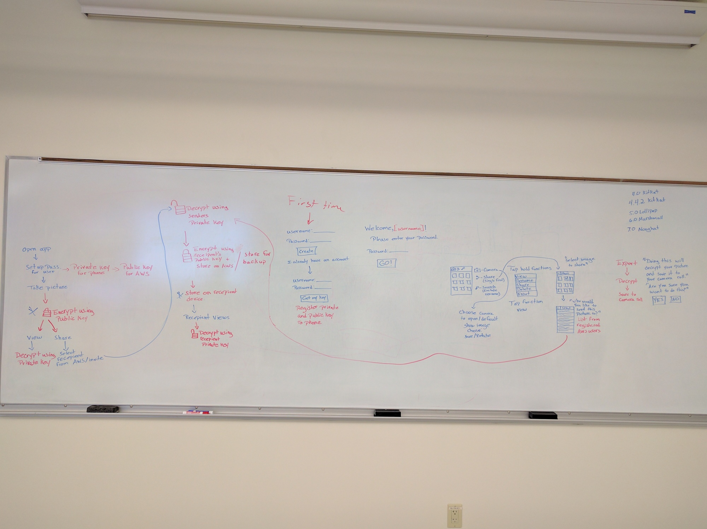

# CryptAPic
An [entry for HackRiddle 2016](http://devpost.com/software/cryptapic) by:
 * [ThomasBassa](https://github.com/ThomasBassa)
 * [NewittAll](https://github.com/NewittAll)
 * [n-vijaykarthik](https://github.com/n-vijaykarthik)
 * & [aJulian42](https://github.com/aJulian42)

This is an Android application, intended to allow people
to both store and share pictures in a secure manner,
using public key encryption. It is far from complete.

The project was built using Android Studio, and should be easily checked out
using that tool.

## Design Sketch

## Licence
MIT
